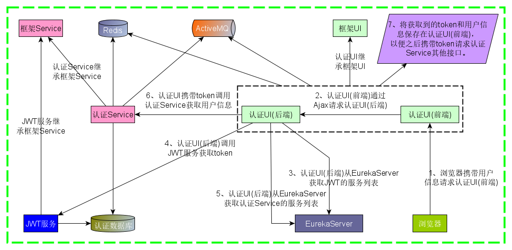
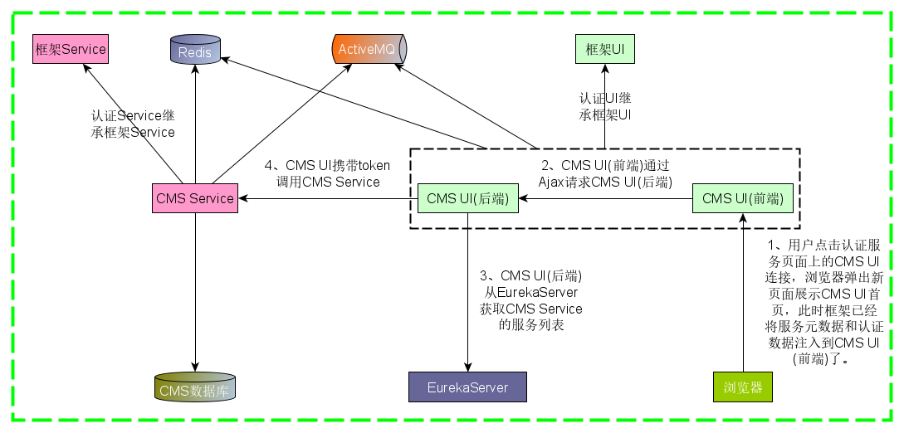

# 框架简介

> 本文档是对框架的整体描述。

> milepost-framework 是一套分布式微服务框架，基于SpringCloud的Greenwich.RELEASE版本构建，
 对应的SpringBoot版本是2.1.0，在SpringCloud基础上增加了分布式微服务架构下开发常用的组件：

* 分部署调度锁，控制一个服务的多个实例的定时任务如何运行 
* 分部署同步锁，实现跨实例的同步方法
* 分布式事务解决方案
* 通过租户、标签、权重，提供了一种人为干预FeignClient和Ribbon负载均衡策略的方式
* OpenFeign、Ribbon、Hystrix、跟踪，admin...
* 基于OAuth2和JWT实现认证服务，为所有业务系统服务提供统一认证服务
* 日志
* License
* ActiveMQ、Redis
* Mybatis-generator 
* Swagger
* Flyway
* 、、、

# 1、框架整体架构
下面通过认证服务登录的流程图来说明框架整体的结构。

* EurekaServer：服务注册中心。
* JWT服务：提供认证服务，必须与认证Service共用同一个数据库。
* 本框架将一个整体的业务系统分为UI和Service两个服务，这两个服务单独部署(分布式)并 
注册到同一个EurekaServer上，UI类服务通过FeignClient调用Service类服务。
* 框架Service：提供Service类服务常用的组件、配置等，所有的Service类服务都应该继承框架Service。
* 框架UI：提供UI类服务常用的组件、配置等，所有的UI类服务都应该继承框架UI。
* 同一个服务部署多个实例(集群)，FeignClient内部集成Ribbon，为多个实例提供负载均衡功能。
* 在Ribbon基础上增加[租户、标签、权重](../3guideForDevelopment/2distributedDevelopment/2tenant.md)概念， 
提供了一种人为干预FeignClient和Ribbon负载均衡策略的方式。
* 认证Service：只暴露RESTful接口供认证UI的FeignClient调用，其中没有前端代码。
* 认证UI：是前后端分离的服务，包含显示给用户的前端代码、接收前端请求的Controller和调用认证Service的FeignClient。
* 认证UI前端：只包含显示给用户的前端静态代码(位于SpringBoot的resources/static下)，通过Ajax请求认证UI后端的RESTful接口。
* 认证UI后端：只包含Controller和调用认证Service的FeignClient，暴露RESTful接口给认证UI前端。
* 认证UI的首页以实例为单位列出当前租户下的所有业务系统服务，点击后直接访问，无需重新认证。

下面以一个CMS系统为例说明业务系统服务是如何在框架上运行的，假设图中的CMS系统就是我们开发好的一个业务系统服务。

* 第1步中，接收框架注入的服务元数据和认证数据见。。。。。

> 使用本框架可以专注于业务系统服务的构建，减少了很多重复性的工作，提高效率。

## 2、框架依赖的服务
除了CMS服务之外的其他服务都是框架必须要依赖的服务，
包括EurekaServer、JWT服务、认证UI、认证Service、Oracle/Mysql、Redis、ActiveMQ，
任何一个服务要正常运行都少不了上述服务的支撑。