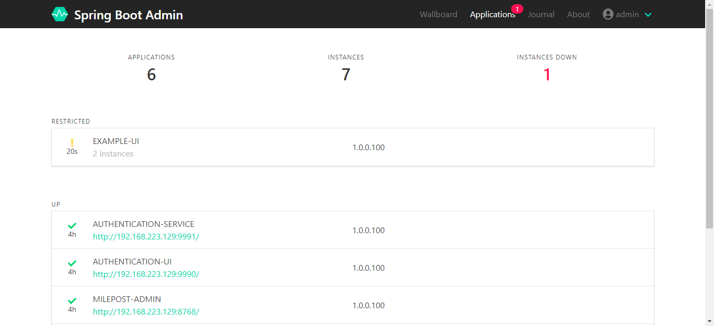

# SpringBoot Admin监控服务(以下简称SBA Server)部署

> 本文档介绍milepost-admin服务的部署。

> 本框架使用de.codecentric:spring-boot-admin-starter-server:2.1.0实现监控，并更改了部分代码来满足本框架中的一些概念和功能。

## 1、软件环境
* JDK1.8+
* 已经启动了[EurekaServer](1eurekaServer.md)

## 2、所需资料

| 文件名                     | 说明       |
| -------------------------- | ---------- |
| milepost-admin-1.0.0.100.jar | 程序jar包 |
| run.sh                     | 启停脚本   |

## 3、服务启停

* 启动

```bash
run.sh start
```

* 查看

```bash
run.sh status
```

* 停止

```bash
run.sh stop
```

* 重启

```bash
run.sh restart
```

##  4、启动脚本中的参数
* Java参数

| 参数名 | 必填 | 默认值 | 说明 |
| -------| ----| ------| ---- |
| ssl   | 否   |false  |是否用https，true启用，false不启用|


* 命令参数

| 参数名                      | 必填 | 默认值 | 说明                                                         |
| ---------------------------| ---- | ------ | ------------------------------------------------------------ |
|spring.profiles.active|是|  |配置文件环境，dev：开发环境；test：测试环境；prod：生产环境|
|server.port|否|8768|服务端口|
|eureka.client.service-url.defaultZone|是|   |EurekaServer地址|
|eureka.instance.ip-address|是|  |服务绑定ip，配置为服务器ip即可|
|spring.boot.admin.ui.title|否|Spring Boot Admin|浏览器Tab上的文字|
|spring.mail.username|否|  |邮箱服务用户名|
|spring.mail.password|否|  |邮箱服务密码|
|spring.mail.host|否|  |邮箱服务host|
|spring.boot.admin.notify.mail.to|否|  |告警邮件接收邮箱|
|spring.boot.admin.discovery.ignored-services|否|  |忽略的服务，配置那些不需要监控的服务的名称，如“[test-appName-1, test-appName-1]”。|
|spring.rabbitmq.host|    否| localhost|    rabbitmq服务ip|
|spring.rabbitmq.port|    否| 5672|    rabbitmq服务端口|
|spring.rabbitmq.username|    否|    guest|    rabbitmq服务用户|
|spring.rabbitmq.password|    否|    guest|    rabbitmq服务密码|
|track.enabled|    否|    true|    链路跟踪功能开关，true打开，false关闭|
|track.sampling|    否|    0.1|     链路跟踪功能采样率|
|multiple-tenant.tenant|否|default|本监控服务实例的租户，不区分大小写，不支持逗号分割，控制这个监控服务实例能监控那些服务实例。|

参数中关于mail的配置是为了增加邮件告警功能的，如不配置则不能使用邮件告警功能。

* 表格中关于spring.mail.*的配置，见[发送邮件](../../3guideForDevelopment/1commonDevelopment/3senderMail.md)
* 表格中关于spring.rabbitmq.*的配置，见[RabbitMQ](../../3guideForDevelopment/1commonDevelopment/14rabbitMQ.md)
* 表格中关于track.*的配置，见[SpringCloud Sleuth](../../3guideForDevelopment/2distributedDevelopment/12springCloudSleuth.md)


## 5、验证


* 查看日志

服务启动成功后，会在jar包所在的目录下生成logs文件夹，里面存放着日志文件，使用下面的命令查看日志。
```bash
tail -f logs/milepost-admin.log -n 300
```
日志中有
```html
...[INFO ] [com.milepost.core.MilepostApplication             : 940 ] - 服务启动完毕。
```
字样表示服务启动成功。

* 访问监控页面

SBA Server不仅暴露出SBA Client的许多敏感数据，还能通过页面动态的更改SBA Client(被SBA Server监控的那些服务)
数据，所以框架将SBA Server保护起来，必须从认证UI上进入SBA Server，看到如下页面表示部署成功。



具体使用方法见[SpringBoot Admin](../../3guideForDevelopment/2distributedDevelopment/10springbootAdmin.md)

## 6、Docker支持

TBD