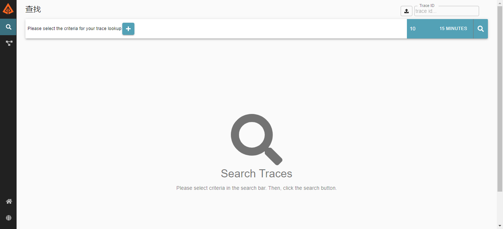

# Zipkin服务部署

> 本文档介绍Zipkin服务的部署。

> 本框架使用zipkin-server-2.21.0-exec.jar来存储和展示服务间调用的链路跟踪数据。

* zipkin 官网：https://zipkin.io/
* zipkin github地址：https://github.com/openzipkin/zipkin

## 1、软件环境
* JDK1.8+
* Elasticsearch 6-7.x

## 2、所需资料

| 文件名                     | 说明       |
| -------------------------- | ---------- |
| zipkin.jar                | 程序jar包 |
| run.sh                     | 启停脚本   |

* 从官网获取Zipkin启动jar包：
```bash
[root@localhost milepost-seluth]# pwd
/opt/root/milepost/milepost-seluth
[root@localhost milepost-seluth]# curl -sSL https://zipkin.io/quickstart.sh | bash -s
[root@localhost milepost-seluth]# ll
total 53340
-rw-rw-r--. 1 root root 54605609 Mar 31 02:51 zipkin.jar
-rw-rw-r--. 1 root root      821 Mar 31 02:51 zipkin.jar.asc
-rw-rw-r--. 1 root root       32 Mar 31 02:51 zipkin.jar.md5
```
从curl的日志中可以看到jar包原名称是“zipkin-server-2.21.0-exec.jar”，
是从“https://repo1.maven.org/maven2/io/zipkin/zipkin-server/2.21.0/zipkin-server-2.21.0-exec.jar”下载的。


## 3、服务启停

Zipkin的启动jar包也是一个SpringBoot程序，与框架中其他服务一样，所以也可以使用统一的启动脚本来启动Zipkin。

* 启动

```bash
run.sh start
```

* 查看

```bash
run.sh status
```

* 停止

```bash
run.sh stop
```

* 重启

```bash
run.sh restart
```

##  4、启动脚本中的参数
* 命令参数

| 参数名                      | 必填 | 默认值 | 说明                                                         |
| ---------------------------| ---- | ------ | ------------------------------------------------------------ |
|server.port                    |否  |9411   |服务端口|
|zipkin.collector.rabbitmq.enabled   |是   |   |开启使用rabbitmq传输链路数据，true开启，false关闭   |
|zipkin.collector.rabbitmq.addresses   |是   |   |用逗号分割的RabbitMQ地址列表，如localhost:5672,localhost:5673   |
|zipkin.collector.rabbitmq.username   |否    |guest   |连接到RabbitMQ时使用的用户名   |
|zipkin.collector.rabbitmq.password   |否   |guest   |连接到RabbitMQ时使用的密码   |
|zipkin.collector.rabbitmq.virtual-host   |否   |/   |使用的RabbitMQ virtual-host   |
|zipkin.collector.rabbitmq.queue   |否   |zipkin   |从中获取span信息的队列名称，为了很好的与SpringCloud结合，请不要更改这个参数，使用默认值即可，否则Zipkin收不到链路数据   |
|zipkin.collector.rabbitmq.concurrency   |否   |1   |并发消费者数量   |
|zipkin.collector.rabbitmq.connection-timeout   |否   |60000   |建立连接时的超时时间，单位ms   |
|zipkin.collector.rabbitmq.useSsl   |否   |false   |设置为true后将使用SSL方式与RabbitMQ建立连接|
|zipkin.storage.type   |是   |   |配置为 elasticsearch，使用elasticsearch存储数据|
|zipkin.storage.elasticsearch.hosts   |是  |   |elasticsearch地址，如http://192.168.223.136:9200|
|zipkin.storage.elasticsearch.index   |否   |zipkin   |存储数据的索引名称，为了很好的与SpringCloud结合，请不要更改这个参数，使用默认值即可|
|zipkin.storage.elasticsearch.timeout   |否   |10000   |连接elasticsearch超时时间|


## 5、验证

* 查看日志

服务启动成功后，会在jar包所在的目录下生成zipkin.log文件，使用下面的命令查看日志。
```bash
tail -f zipkin.log -n 300
```
日志中有
```html
...INFO 4777 --- [           main] z.s.ZipkinServer  : Started ZipkinServer in 6.946 seconds (JVM running for 9.099)
```
字样表示服务启动成功。

* 访问Zipkin页面
```
http(s)://${所部署的服务ip}:${server.port}/
```
看到如下页面表示部署成功。



## 6、Docker支持

TBD