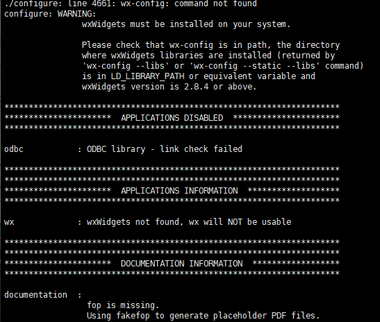

# RabbitMQ

> 本文档讲述RabbitMQ 3.7.12 在CentOS7.7 下的安装，Erlang版本是22.1。

## 1、安装erlang
由于rabbitmq是基于erlang语言开发的，所以必须先安装erlang。
 
安装依赖
```bash
[root@localhost rabbitmq_server-3.7.12]# yum -y install gcc glibc-devel make ncurses-devel openssl-devel xmlto perl wget gtk2-devel binutils-devel
```

获取erlang安装包
```bash
[root@localhost erl]# pwd
/opt/root/software/erl
[root@localhost erl]# wget http://erlang.org/download/otp_src_22.1.tar.gz
```

解压
```bash
[root@localhost erl]# tar -zxvf otp_src_22.1.tar.gz
```
 
移走
```bash
[root@localhost erl]# mv otp_src_22.1 /usr/local/
```
 
切换目录
```bash
[root@localhost erl]# cd /usr/local/otp_src_22.1/
```
 
创建即将安装的目录
```bash
[root@localhost otp_src_22.1]# mkdir ../erlang
```
 
配置安装路径
```bash
[root@localhost otp_src_22.1]# ./configure --prefix=/usr/local/erlang
```
如果遇到这个错 你就假装没看到


安装
```bash
[root@localhost otp_src_22.1]# make install
```
 
查看一下是否安装成功
```bash
[root@localhost otp_src_22.1]# ll /usr/local/erlang/bin
```

添加环境变量，将下面的代码写进/etc/profile文件中，
```bash
export PATH=$PATH:/usr/local/erlang/bin
```
 
刷新环境变量
```bash
[root@localhost otp_src_22.1]# source /etc/profile
```
 
甩一条命令
```bash
[root@localhost erlang]# erl
Erlang/OTP 22 [erts-10.5] [source] [64-bit] [smp:1:1] [ds:1:1:10] [async-threads:1] [hipe]

Eshell V10.5  (abort with ^G)
1> 
```

## 2、安装RabbitMQ

获取erlang安装包
```bash
[root@localhost software]# wget https://github.com/rabbitmq/rabbitmq-server/releases/download/v3.7.12/rabbitmq-server-generic-unix-3.7.12.tar.xz
```

由于是安装包是tar.xz格式的，所以需要用到xz，先安装xz
```bash
[root@localhost software]# yum install -y xz
```
 
第一次解压
```bash
[root@localhost software]# /bin/xz -d rabbitmq-server-generic-unix-3.7.12.tar.xz
```
 
第二次解压
```bash
[root@localhost software]# tar -xvf rabbitmq-server-generic-unix-3.7.12.tar
```
 
移走
```bash
[root@localhost software]# mv rabbitmq_server-3.7.12/ /opt/root/module
```

添加环境变量，将下面的代码写进/etc/profile文件中，
```bash
export PATH=$PATH:/opt/root/module/rabbitmq_server-3.7.12/sbin
```
 
刷新环境变量
```bash
[root@localhost software]# source /etc/profile
```
 
创建配置目录
```bash
[root@localhost software]# mkdir /etc/rabbitmq
```

## 3、RabbitMQ启停
启动
```bash
[root@localhost software]# rabbitmq-server -detached
```
 
停止
```bash
[root@localhost software]# rabbitmqctl stop
```
 
查看
```bash
[root@localhost software]# rabbitmqctl status
```

## 4、RabbitMQ WEB管理
开启web插件
```bash
[root@localhost software]# rabbitmq-plugins enable rabbitmq_management
```

访问：http://${服务器ip}:15672/，
默认账号密码：guest/guest，这个帐号只允许在RabbitMQ服务所在的服务器上访问。


## 5、RabbitMQ 用户管理

查看所有用户
```bash
[root@localhost software]# rabbitmqctl list_users
```

添加一个用户
```bash
[root@localhost software]# rabbitmqctl add_user admin admin
```
 
配置权限
```bash
[root@localhost software]# rabbitmqctl set_permissions -p "/" admin ".*" ".*" ".*"
```

查看用户权限
```bash
[root@localhost software]# rabbitmqctl list_user_permissions admin
```

设置tag
```bash
[root@localhost software]# rabbitmqctl set_user_tags admin administrator
```
 
重启
```bash
[root@localhost software]# rabbitmqctl stop
[root@localhost software]# rabbitmq-server -detached
```