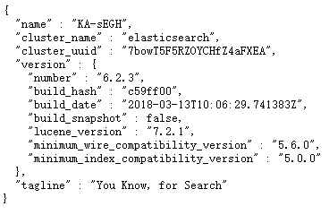

# Elasticsearch

> 本文档讲述Elasticsearch 6.2.3 在CentOS7.7 下的安装。

* 获取安装包
```bash
[root@localhost elasticsearch]# pwd
/opt/root/software/elasticsearch
[root@localhost elasticsearch]# https://artifacts.elastic.co/downloads/elasticsearch/elasticsearch-6.2.3.tar.gz
```

* 解压
```bash
[root@localhost elasticsearch]# tar -zxvf elasticsearch-6.2.3.tar.gz -C ../../module/
```

* 建立es专用用户
创建elasticsearch用户组及elasticsearch用户
```bash
[root@localhost elasticsearch]# groupadd elasticsearch
[root@localhost elasticsearch]# useradd elasticsearch -g elasticsearch
[root@localhost elasticsearch]# passwd elasticsearch (123!@#qweQWE)
```

更改elasticsearch文件夹及内部文件的所属用户及组为elasticsearch:elasticsearch
```bash
[root@localhost module]# pwd
/opt/root/module
[root@localhost module]# chown -R elasticsearch:elasticsearch elasticsearch-6.2.3
```

* 启动报错

1、max file descriptors [4096] for elasticsearch process is too low, increase to at least [65536]

每个进程最大同时打开文件数太小，可通过下面2个命令查看当前数量
```bash
[elasticsearch@localhost elasticsearch-6.2.3]$ ulimit -Hn
4096
[elasticsearch@localhost elasticsearch-6.2.3]$ ulimit -Sn
1024
```
使用root用户修改/etc/security/limits.conf文件，增加配置，用户退出后重新登录生效
```bash
*               soft    nofile          65536
*               hard    nofile          65536
```

2、max virtual memory areas vm.max_map_count [65530] is too low, increase to at least [262144]

修改/etc/sysctl.conf文件，增加如下配置：
```bash
vm.max_map_count=262144
```
刷新配置
```bash
[root@localhost module]# sysctl -p
vm.max_map_count = 262144
```

* 配置elasticsearch

elasticsearch相关配置在
```bash
/opt/root/module/elasticsearch-6.2.3/config/elasticsearch.yml
```

修改
network.host: 192.168.223.136

* 启动
```bash
[root@localhost module]# su elasticsearch
[elasticsearch@localhost module]$ ./elasticsearch-6.2.3/bin/elasticsearch
[2020-04-06T01:36:02,325][INFO ][o.e.n.Node               ] [] initializing ...
...
...
[2020-04-06T01:36:17,654][INFO ][o.e.n.Node               ] [KA-sEGH] started
[2020-04-06T01:36:17,700][INFO ][o.e.g.GatewayService     ] [KA-sEGH] recovered [0] indices into cluster_state
```

* 后台启动

后台启动时可以指定参数，就不用事先配置了
```bash
[elasticsearch@localhost module]$ ./elasticsearch-6.2.3/bin/elasticsearch -Enetwork.host=192.168.223.136 -d
```

* 停止
```bash
[elasticsearch@localhost module]$ kill -15 pid
```

* 访问
http://192.168.223.136:9200



* 删除“zipkin*”索引下的数据
```html
curl "http://192.168.223.136:9200/zipkin*" \
-X DELETE
```