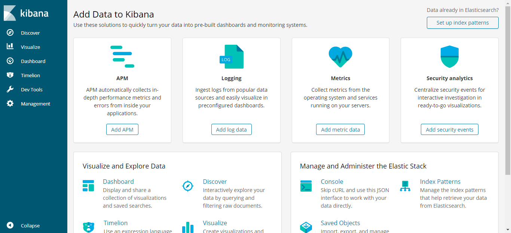

# Kibana

> 本文档讲述Kibana 6.2.3 在CentOS7.7 下的安装。

* 获取安装包
```bash
[root@localhost elasticsearch]# pwd
/opt/root/software/elasticsearch
[root@localhost elasticsearch]# https://artifacts.elastic.co/downloads/kibana/kibana-6.2.3-linux-x86_64.tar.gz
```

* 解压
```bash
[root@localhost elasticsearch]# tar -zxvf kibana-6.2.3-linux-x86_64.tar.gz ../../module/
```

* 配置
kibana配置在
```bash
/opt/root/module/kibana-6.2.3-linux-x86_64/config/kibana.yml
```

修改
server.host: "192.168.223.136"
elasticsearch.url: http://192.168.223.136:9200

* 启动
```bash
[root@localhost module]# ./kibana-6.2.3-linux-x86_64/bin/kibana
  log   [18:32:53.438] [info][status][plugin:kibana@6.2.3] Status changed from uninitialized to green - Ready
  log   [18:32:53.505] [info][status][plugin:elasticsearch@6.2.3] Status changed from uninitialized to yellow - Waiting for Elasticsearch
  log   [18:32:53.687] [info][status][plugin:timelion@6.2.3] Status changed from uninitialized to green - Ready
  log   [18:32:53.694] [info][status][plugin:console@6.2.3] Status changed from uninitialized to green - Ready
  log   [18:32:53.701] [info][status][plugin:metrics@6.2.3] Status changed from uninitialized to green - Ready
  log   [18:32:53.746] [info][listening] Server running at http://192.168.223.136:5601
  log   [18:32:53.897] [info][status][plugin:elasticsearch@6.2.3] Status changed from yellow to green - Ready
```

* 后台启动

启动时可以指定参数，就不用事先配置了
```bash
[root@localhost module]# nohup /opt/root/module/kibana-6.2.3-linux-x86_64/bin/kibana \
--elasticsearch=http://192.168.223.136:9200 \
--host=192.168.223.136 \
--log-file=/opt/root/module/kibana-6.2.3-linux-x86_64/kibana.log \
>/dev/null 2>&1 &
```

* 停止
```bash
[root@localhost module]$ kill -15 pid
```

* 访问
http://192.168.223.136:5601




