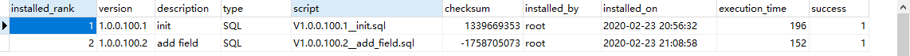
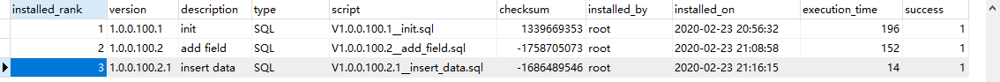
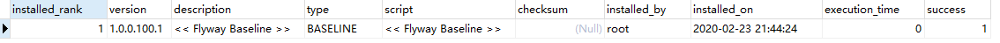

# Flyway

> 本文档介绍框架中使用flyway的方法和使用过程中的注意事项。

* 使用flyway之前必须先配置数据源，保证服务能连接上数据库，所以一般来讲只在service类服务中使用flyway。

## 1、flyway开启与关闭

框架默认已经开启了flyway，如开启flyway则必须保证有数据库脚本存在， 
否则报错，可以使用下面的配置关闭flyway

```yaml
spring: 
  flyway:
    enabled: false
```

## 2、数据库脚本

数据库脚本文件需要按照flyway指定规定命名，具体格式如下：

V{项目版本号}.{数据库版本号}__{版本描述}.sql

* 项目版本号：项目pom文件中的project.version的值。
* 数据库版本号：当前脚本的版本号
* 版本描述：对版本的描述
* 数据库版本号和版本描述之间用双下划线分隔

脚本文件存储在项目的resource/db/{spring.datasource.druid.db_type}目录下，其中{spring.datasource.druid.db_type}支持mysql、oracle。

## 3、起初使用flyway的例子

* 初始化数据库脚本V1.0.0.100.1__init.sql

```sql
/* 学生表 */
CREATE TABLE student (
  ID varchar(40) NOT NULL,
  NAME varchar(16) DEFAULT NULL COMMENT '姓名',
  STU_NO varchar(32) DEFAULT NULL COMMENT '学号',
  BIRTH timestamp NULL DEFAULT NULL ON UPDATE CURRENT_TIMESTAMP COMMENT '出生日期',
  SCORE float(5,2) DEFAULT NULL COMMENT '分数',
  REMARK mediumtext COMMENT '评价',
  CLASSES_ID varchar(40) DEFAULT NULL COMMENT '班级id',
  PRIMARY KEY (ID)
) ;
```

启动服务后，可以看到如下日志
```shell
Flyway Community Edition 5.2.1 by Boxfuse
Database: jdbc:mysql://192.168.223.129:3306/milepost_auth (MySQL 5.7)
load ContextCore[null] extension by class[io.seata.core.context.ThreadLocalContextCore]
Successfully validated 1 migration (execution time 00:00.032s)
Creating Schema History table: `milepost_auth`.`flyway_md_authentication-service`
Current version of schema `milepost_auth`: << Empty Schema >>
Migrating schema `milepost_auth` to version 1.0.0.100.1 - init
Successfully applied 1 migration to schema `milepost_auth` (execution time 00:00.480s)
```

可以看到flyway在数据库中创建了一个名称为flyway_md_authentication-service的表， 
这个表是flyway的版本记录表，其名称默认是flyway_md_${spring.application.name}， 
可以通过在yml中配置spring.flyway.table属性来改变。

flyway_md_authentication-service表中可以看到如下记录


此时flyway初始化了基线版本1.0.0.100.1<br><br>


* 增加字段数据库脚本V1.0.0.100.2__add_field.sql

```sql
/* student表增加 age 字段 */
alter table student add AGE int;
```
重新启动服务后，可以看到如下日志

```shell
Flyway Community Edition 5.2.1 by Boxfuse
Database: jdbc:mysql://192.168.223.129:3306/milepost_auth (MySQL 5.7)
load ContextCore[null] extension by class[io.seata.core.context.ThreadLocalContextCore]
Successfully validated 2 migrations (execution time 00:00.075s)
Current version of schema `milepost_auth`: 1.0.0.100.1
Migrating schema `milepost_auth` to version 1.0.0.100.2 - add field
Successfully applied 1 migration to schema `milepost_auth` (execution time 00:00.202s)
```

在flyway_md_authentication-service表中可以看到如下记录


此时flyway将数据库版本升级到了1.0.0.100.2<br><br>


* 插入初始化数据数据库脚本V1.0.0.100.2.1__insert_data.sql

```sql
/* 向student表中插入初始化数据 */
INSERT INTO student VALUES ('10', '10', '10', '1990-01-10 00:00:00', '10.00', '10', '03', 11);
```
重新启动服务后，可以看到如下日志

```shell
Flyway Community Edition 5.2.1 by Boxfuse
Database: jdbc:mysql://192.168.223.129:3306/milepost_auth (MySQL 5.7)
load ContextCore[null] extension by class[io.seata.core.context.ThreadLocalContextCore]
Successfully validated 3 migrations (execution time 00:00.064s)
Current version of schema `milepost_auth`: 1.0.0.100.2
Migrating schema `milepost_auth` to version 1.0.0.100.2.1 - insert data
Successfully applied 1 migration to schema `milepost_auth` (execution time 00:00.041s)
```

在flyway_md_authentication-service表中可以看到如下记录


此时flyway将数据库版本升级到了1.0.0.100.2.1<br><br>


## 4、已有项目使用flyway的例子

> 已有项目的数据库中已经存在数据，在使用flyway时与项目起初使用flyway有一些区别。 
假设以上例子中的项目已经部署到生产环境，并且数据库版本停留在1.0.0.100.2.1的状态。 
下面的例子演示如何在这种情况下使用flyway。

* 整理现有数据库表结构，形成初始化版本V1.0.0.100.1__init.sql
```sql
/* 学生表 */
CREATE TABLE student (
  ID varchar(40) NOT NULL,
  NAME varchar(16) DEFAULT NULL COMMENT '姓名',
  STU_NO varchar(32) DEFAULT NULL COMMENT '学号',
  BIRTH timestamp NULL DEFAULT NULL ON UPDATE CURRENT_TIMESTAMP COMMENT '出生日期',
  SCORE float(5,2) DEFAULT NULL COMMENT '分数',
  REMARK mediumtext COMMENT '评价',
  CLASSES_ID varchar(40) DEFAULT NULL COMMENT '班级id',
  AGE int DEFAULT NULL COMMENT '年龄',
  PRIMARY KEY (ID)
) ;
```

* 在yml增加如下配置项
```yaml
spring.flyway.baseline-version=1.0.0.100.1
```
设置flyway基线版本与初始化脚本的版本号一致，这样1.0.0.100.1和以前的版本就不会被flyway执行。

启动服务后，可以看到如下日志
```shell
Flyway Community Edition 5.2.1 by Boxfuse
Database: jdbc:mysql://192.168.223.129:3306/milepost_auth (MySQL 5.7)
load ContextCore[null] extension by class[io.seata.core.context.ThreadLocalContextCore]
Successfully validated 1 migration (execution time 00:00.029s)
Creating Schema History table: `milepost_auth`.`flyway_md_authentication-service`
Successfully baselined schema with version: 1.0.0.100.1
Current version of schema `milepost_auth`: 1.0.0.100.1
Schema `milepost_auth` is up to date. No migration necessary.
```

可以看到flyway再次在数据库中创建了一个名称为flyway_md_authentication-service的表。

flyway_md_authentication-service表中可以看到如下记录


可以看到基线版本是从1.0.0.100.1开始的，并且1.0.0.100.1这个脚本没有被执行。

* 项目在后续的开发运维中，可以像4中描述的那样使用flyway。

## 5、注意事项

* flyway加载顺序问题

由于Spring中bean的加载顺序问题，flyway的初始化可能晚于某个具体的bean， 
当在该bean的构造方法或者@PostConstruct修饰的方法中对flyway脚本中新增的表或字段进行操作时， 
会报不存在的错误，针对此种情况可通过注解@DependsOn({"flywayInitializer"})处理， 
确保该bean的实例化在flyway之后。

```java
@Service
@DependsOn({"flywayInitializer"})
public class TestService {
    
    @Autowired
    private TestMapper testMapper;
    
    @PostConstruct
    public void init() {
        LOG.info("类实例化");
        try {
            testMapper.initData();
        } catch (SQLException e) {
            e.printStackTrace();
        }
    }
}
```

* 已经被flyway执行过sql脚本不能再修改，否则会导致无法升级。

每一个sql脚本对应一个checksum字段值，当sql脚本内容发生变化时，这个字段的值会随着变化，<br> 
每次启动应用时，flyway会计算当前脚本的checksum值，然后将新值与flyway表中的旧值对比，<br>
如果新值与旧值不同，flyway就会尝试先清空数据库表并重新创建，但是由于框架禁用了flyway的清空数据功能(因为清空数据在生产环境是很危险的操作)，所以flyway就会报错。
针对这个问题，<br>
在开发环境，开发者需要了解一定的flyway特性并根据实际情况自行处理。<br>
在生产环境中，一个脚本一旦被flyway执行成功了，就不要再去改动这个脚本了，即使是加入注释也不可以，如果确实有数据改动的需求，可以通过增加脚本来解决。<br>

* 事务

sql脚本中的DML在一个脚本文件中会保证在一个事务里，当一个DML语句失败后，本脚本中的其他已经执行的DML语句全部回滚，DDL无事务。
