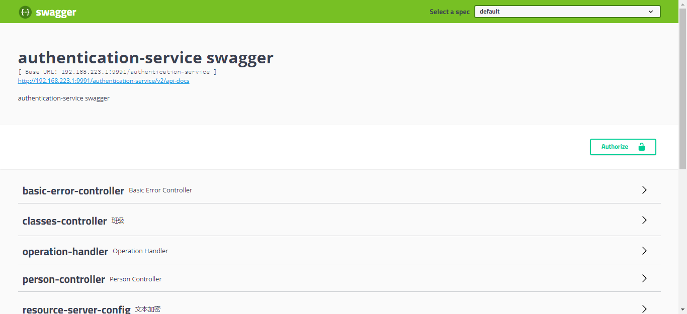

# Swagger

> 本文档描述框架提供的swagger功能。

> 本框架使用com.spring4all:swagger-spring-boot-starter:1.9.1.RELEASE实现swagger功能。

* 只有Service类服务才能使用swagger功能，swagger地址是
```html
http(s)://${eureka.instance.ip-address}:${server.port}/${server.servlet.context-path}/swagger-ui.html
```
* 默认情况下，Service类服务的spring.profiles.active=dev时开启swagger功能，
开发者可以通过可以通过swagger.enabled=true/false来控制swagger功能的开启和关闭，
除此之外还可以配置如下属性，更多的属性见[spring-boot-starter-swagger](https://github.com/SpringForAll/spring-boot-starter-swagger)。

| 参数名                      | 必填 | 默认值 | 说明|
| ----------------------------|-----|-------|--------|
|swagger.title|否 |${spring.application.name} + " swagger"|swagger-ui页面上的title|
|swagger.description|否  |${spring.application.name} + " swagger"|swagger-ui页面上title下方的描述信息|

* swagger页面如下图：


* 请求swagger上的接口之前需要配置token

点击上图中的“Authorize”按钮，在弹出的对话框中填入“Bearer ${token}”，
点击对话框中的“Authorize”按钮即可完成token的配置。

* 获取token的方法见[获取有效的token](7getToken.md)，
token是有失效时间的，默认是7200s，关于token的失效时间见[JWT服务部署](../../2userManual/1baseServerDeploy/2jwtServer.md)中 第4节启动脚本中的参数。
