# SpringBoot Admin

> 本文档描述框架对SpringBoot Admin的使用。
> 本框架使用的SpringBoot Admin依赖是de.codecentric:spring-boot-admin-starter-server:2.1.0。

# 1、术语
* SBA Server：以下将SpringBoot Admin简称为SBA Server，意思是SpringBoot Admin服务端。 
* SBA Client：以下将SpringBoot Admin监控的服务简称为SBA Client，意思是SpringBoot Admin客户端。 

# 2、相关说明
* SpringBoot Admin 官方文档在 https://codecentric.github.io/spring-boot-admin/2.1.0/
* SpringBoot Admin github 地址 https://github.com/codecentric/spring-boot-admin
* 首先需要部署监控服务，具体见[SpringBoot Admin监控服务部署](../../2userManual/1baseServerDeploy/5milepost-admin.md)。
* 框架更改了SBA Server部分代码，实现了[租户](../../3guideForDevelopment/2distributedDevelopment/2tenant.md)隔离模式的监控，
即每个租户都有自己的SBA Server，这个SBA Server监控自己租户下的SBA Client。
* SBA Server不仅暴露出SBA Client的许多敏感数据，还能通过页面动态的更改SBA Client数据，所以框架将SBA Server保护起来，必须从认证UI上进入SBA Server。
* 为了使SBA Server能尽可能多的从SBA Client抓取指标数据，框架开启了spring-boot-starter-actuator的所有端点，并将这些端点用Oauth保护起来，
SBA Server每次抓取数据时需要传入凭证，这部分功能框架已经实现了，这也是框架对SBA Server改动最大的地方。
* 框架为SBA Server开启了发送告警邮件功能，在启动脚本中配置发送邮件相关的属性就可以开启这个功能。

# 3、SpringBoot Admin页面和常用功能
## 3.1、首页
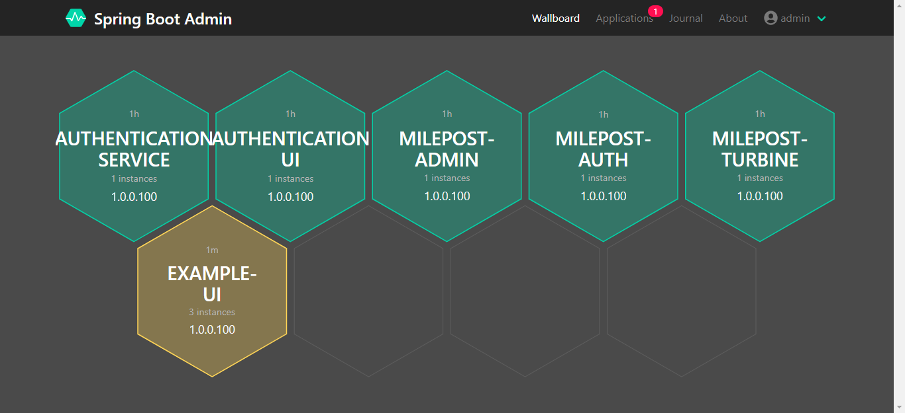
* 首页显示出监控到的所有服务，点击单实例的服务进入实例详情页面，点击多实例的服务进入实例列表页面。

## 3.2、服务列表页面
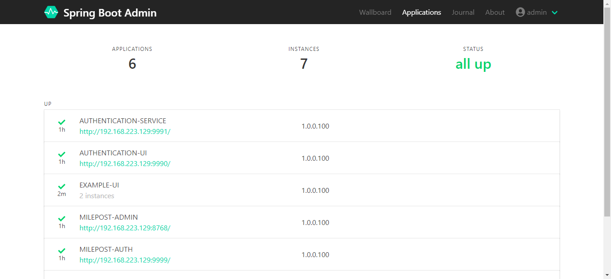
* 服务列表页面显示服务数、实例数、实例状态、版本、实例Url等信息。
* 点击列表中的服务进入实例列表页面，点击实例进入实例详情页面。
* 如配置了发送邮箱相关属性开启了邮件告警功能，则可以在服务列表页面抑制告警。

## 3.3、实例详情页面
### 3.3.1、insights>Details
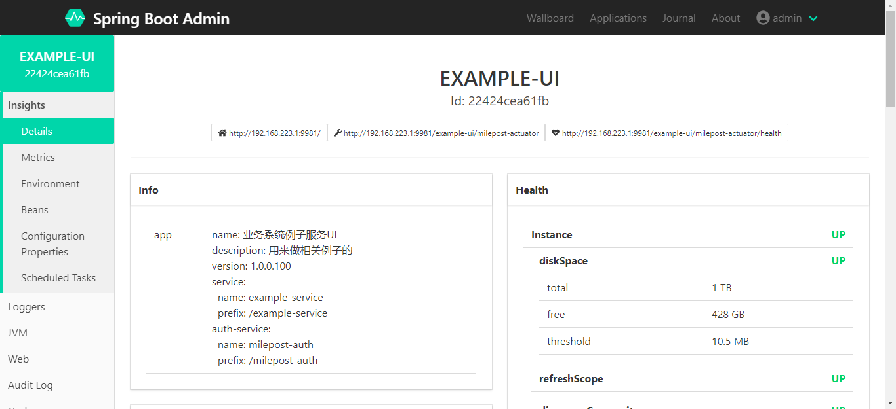
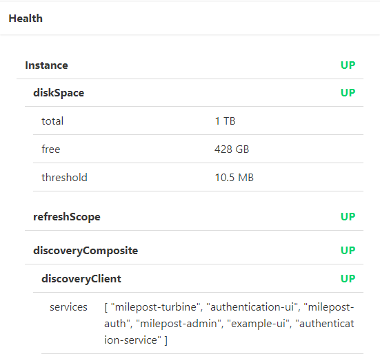
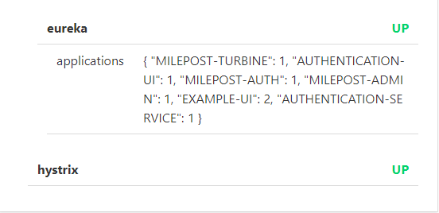
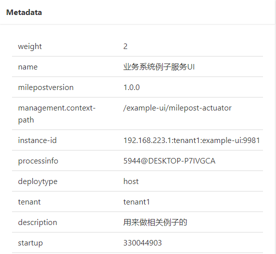
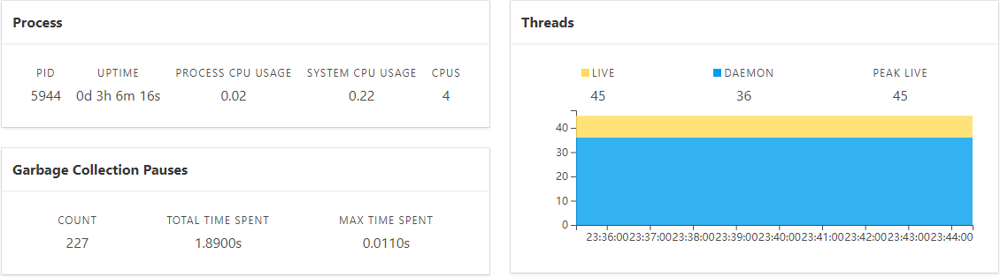
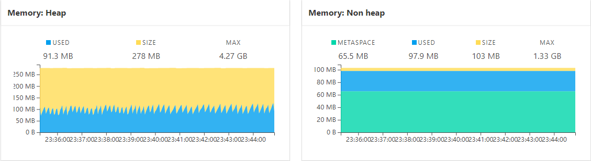

### 3.3.2、insights>Environment
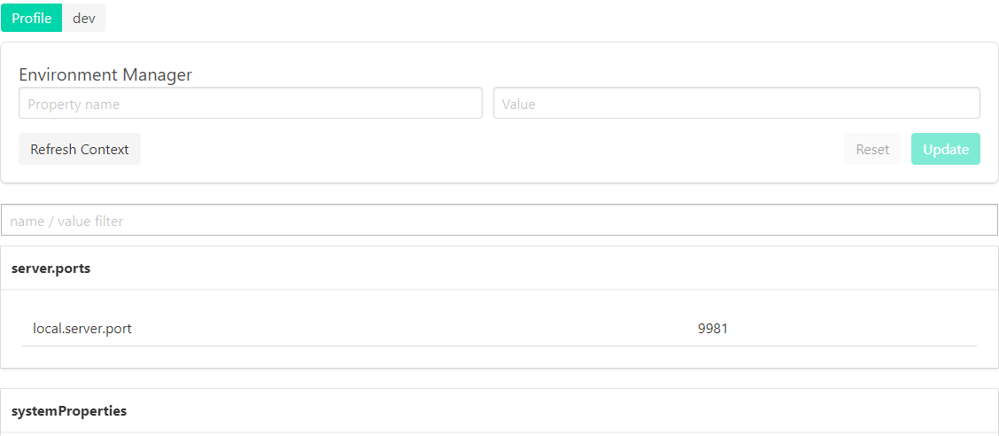
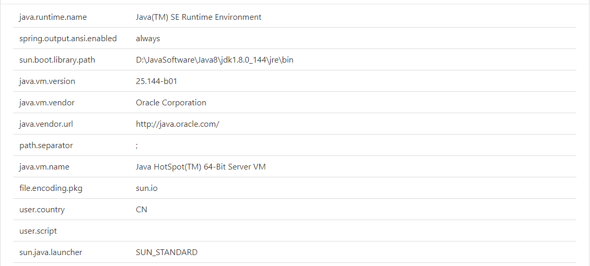
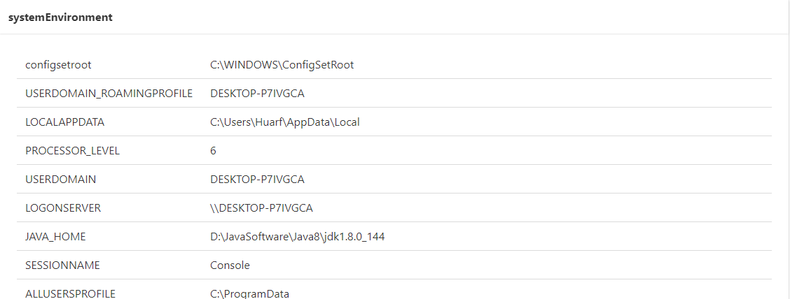
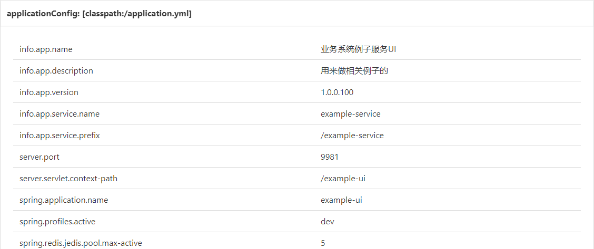
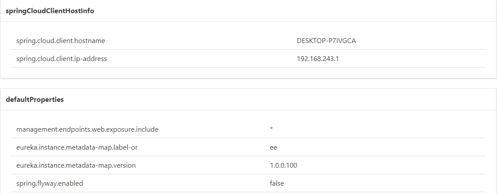

### 3.3.3、insights>Scheduled Tasks
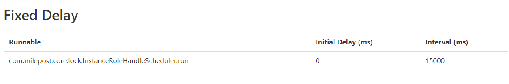

### 3.3.4、logging>Logfile
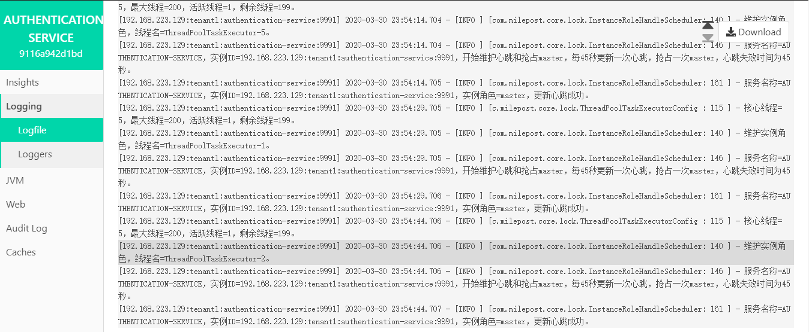
* 可以实时查看日志，可以下载日志文件。

### 3.3.5、logging>Loggers
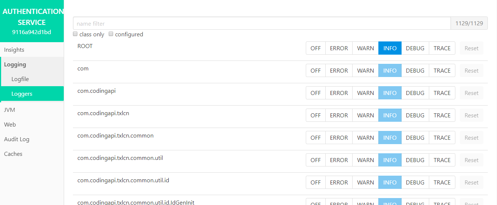
* 可以实时更改指定类、包的日志打印级别。

### 3.3.6、Audit Log
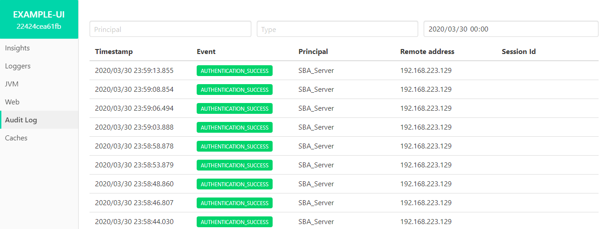
* 显示认证日志。

## 3.4、Audit Log
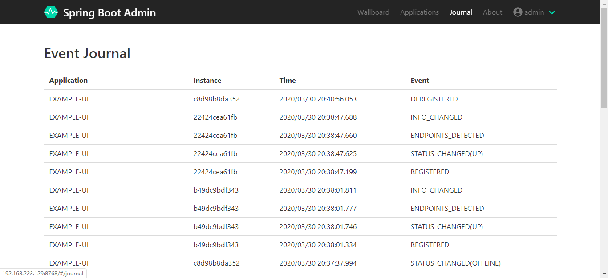
* 显示事件日志。

