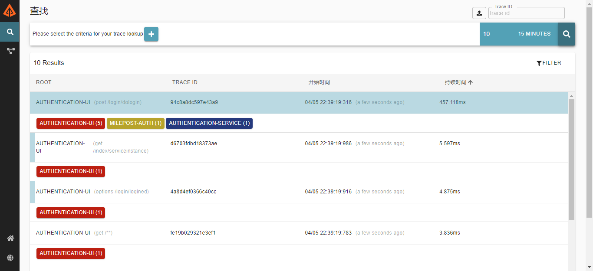
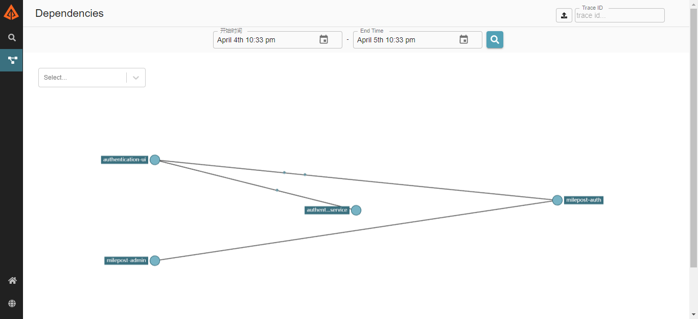

# SpringCloud Sleuth

> 本文档描述框架如何将SpringCloud Sleuth与Zipkin结合来实现分布式链路跟踪功能。
> 本框架使用的sleuth和zipkin的版本是
org.springframework.cloud:spring-cloud-starter-sleuth:2.1.0.RELEASE，
org.springframework.cloud:spring-cloud-starter-zipkin:2.1.0.RELEASE，
Zipkin-Server服务的版本是2.21.0，其部署方法见[Zipkin服务部署](../../2userManual/1baseServerDeploy/6zipkin.md)

* spring-cloud-sleuth 官方文档：https://cloud.spring.io/spring-cloud-sleuth/2.1.x/single/spring-cloud-sleuth.html
* spring-cloud-sleuth github地址：https://github.com/spring-cloud/spring-cloud-sleuth
* zipkin 官网：https://zipkin.io/
* zipkin github地址：https://github.com/openzipkin/zipkin


# 1、spring-cloud-sleuth链路数据传输方式
spring-cloud-sleuth支持通过Http请求异步上报链路数据到Zipkin，还支持利用消中间件(支持RabbitMQ和Kafka，同SpringCloud Bud)传输链路数据。
在我们的框架中选择的是消息中间件方式中的RabbitMQ。

## 1.1、Http方式
虽然通过异步的http请求来上报数据，也不能保证在Zipkin服务停止后对被监控服务的影响，
所以这里只给出Http方式的配置，不多做详细介绍，框架中不使用这种方式。
```yaml
spring:
  sleuth:
    web:
      client:
        enabled: true
    sampler:
      # 跟踪采样路，0--1，默认是 0.1
      probability: 1.0
  zipkin:
    enabled: true
    # Zipkin服务器地址
    base-url: http://192.168.223.136:9411/
    sender:
      # http方式上报数据
      type: web
```

## 1.2、RabbitMQ方式详解
RabbitMQ传输链路数据的流程是 被监控的服务将自己的链路数据推送到RabbitMQ，
Zipkin服务端从RabbitMQ收取链路数据，即时Zipkin服务停止了，也不会对被监控服务产生影响。
要使用RabbitMQ传输链路数据需要在被监控的服务中增加org.springframework.cloud:spring-cloud-stream-binder-rabbit:2.1.0.RELEASE依赖，
并分别配置Zipkin服务端和被监控的服务。

### 1.2.1、配置Zipkin服务端
配置Zipkin服务端连接的RabbitMQ信息：
```yaml
zipkin:
  collector:
    rabbitmq:
      enabled: true
      addresses: 192.168.223.136:5672
      username: admin
      password: admin
```
上面的参数都是配置在Zipkin服务的启动脚本中的，具体见[Zipkin服务部署](../../2userManual/1baseServerDeploy/6zipkin.md)。

### 1.2.2、配置被监控的服务
配置被监控的服务连接的RabbitMQ信息、开启sleuth、配置被惊恐服务向Zipkin服务端上报数据的方式：
```yaml
spring: 
  # RabbitMQ信息
  rabbitmq:
    host: 192.168.223.136
    port: 5672
    username: admin
    password: admin
  # 开启sleuth
  sleuth:
    web:
      client:
        enabled: true
    sampler:
      # 跟踪采样率，0--1，默认是 0.1
      probability: 1.0
  zipkin:
    sender:
      # RabbitMQ方式上报数据
      type: rabbit
```
本框架将以上关于spring.sleuth和spring.zipkin的配置封装起来，
如想开启链路跟踪功能并使用RabbitMQ方式上报数据，则只需做以下配置即可：
```yaml
spring: 
  # RabbitMQ信息
  rabbitmq:
    host: 192.168.223.136
    port: 5672
    username: admin
    password: admin
track:
  # 开启链路跟踪功能，默认true，即框架默认开启了链路跟踪功能。
  enabled: true
  # 跟踪采样率，0--1，默认是 0.1
  sampling: 1.0
```

* 注意：本框架中使用链路跟踪功能需要RabbitMQ，如程序中没有RabbitMQ相关配置却开启了链路跟踪功能，
则程序将使用默认的RabbitMQ配置信息去连接RabbitMQ服务，默认的RabbitMQ配置如下：
```yaml
spring: 
  # RabbitMQ信息
  rabbitmq:
    host: localhost
    port: 5672
    username: guest
    password: guest
```

# 2、Zipkin Web UI
Zipkin提供了展示链路数据的UI界面，具体如下：

服务间调用的链路数据页面如下：

* 左上角的“trace id...”处输入日志中打印的TraceId，按下回车即可查询整个链路数据，得知与本日志相关的所有服务。


服务间调用依赖关系页面


其含义比较简单，这里不做详细介绍，而且Zipkin的Web UI并不是唯一的展示方式，请继续往下看。

# 3、Zipkin数据存储方式
Zipkin通过Storage组件来存储链路数据，默认会将这些数据存储在内存中，同时支持多种存储策略，
比如将数据存储在MySQL、Cassandra和Elasticsearch中，在我们的框架中选择的是Elasticsearch。

通过Elasticsearch存储数据需要在Zipkin端做Elasticsearch相关配置：
```yaml
zipkin:
  storage:
    type: elasticsearch
    elasticsearch:
      hosts: http://192.168.223.136:9200
      index: zipkin
      timeout: 10000
```
上面的参数都是配置在Zipkin服务的启动脚本中的，具体见[Zipkin服务部署](../../2userManual/1baseServerDeploy/6zipkin.md)。


* 本框架中使用2.21.0版本的Zipkin，其支持的Elasticsearch版本是5-7.x。
* 关于Elasticsearch的部署见[Elasticsearch](../../2userManual/2middlewareDeploy/4elasticsearch.md)。
* Elasticsearch中的数据可以通过Kibana来展示，关于的部署见[Kibana](../../2userManual/2middlewareDeploy/5kibana.md)。

# 4、利用zipkin-dependencies生成服务间调用依赖关系
Zipkin将数据存储在内存中时，不需要使用zipkin-dependencies来生成服务间调用依赖关系，
当使用Elasticsearch作为存储介质时，Zipkin需要依靠zipkin-dependencies来生成服务间调用依赖关系，
zipkin-dependencies组件的具体使用步骤如下：

* 1、获取zipkin-dependencies组件jar包
```bash
[root@localhost milepost-seluth]# curl -sSL https://zipkin.io/quickstart.sh | bash -s io.zipkin.dependencies:zipkin-dependencies:LATEST zipkin-dependencies.jar
```
从curl的日志中可以看到使用的是2.4.2版本的zipkin-dependencies。

* 2、配置脚本中的变量

| 变量名                      | 说明  |
| ---------------------------| --- |
|ES_HOSTS   |elasticsearch地址，如192.168.223.136:9200|

* 3、生产服务间调用依赖关系
```bash
[root@localhost milepost-seluth]# ./generator-dependencies.sh
20/04/09 03:51:32 WARN Utils: Your hostname, localhost.localdomain resolves to a loopback address: 127.0.0.1; using 192.168.223.136 instead (on interface ens33)
20/04/09 03:51:32 WARN Utils: Set SPARK_LOCAL_IP if you need to bind to another address
20/04/09 03:51:33 INFO ElasticsearchDependenciesJob: Processing spans from zipkin:span-2020-04-08/span
20/04/09 03:51:33 WARN NativeCodeLoader: Unable to load native-hadoop library for your platform... using builtin-java classes where applicable
20/04/09 03:51:35 WARN Java7Handlers: Unable to load JDK7 types (java.nio.file.Path): no Java7 type support added
20/04/09 03:51:45 WARN Resource: Detected type name in resource [zipkin:span-2020-04-08/span]. Type names are deprecated and will be removed in a later release.
...
20/04/09 03:51:45 WARN Resource: Detected type name in resource [zipkin:span-2020-04-08/span]. Type names are deprecated and will be removed in a later release.
20/04/09 03:51:51 INFO ElasticsearchDependenciesJob: Saving dependency links to zipkin:dependency-2020-04-08/dependency
...
20/04/09 03:51:51 WARN Resource: Detected type name in resource [zipkin:dependency-2020-04-08/dependency]. Type names are deprecated and will be removed in a later release.
20/04/09 03:51:51 WARN Resource: Detected type name in resource [zipkin:dependency-2020-04-08/dependency]. Type names are deprecated and will be removed in a later release.
20/04/09 03:51:52 INFO ElasticsearchDependenciesJob: Processing spans from zipkin-span-2020-04-08
20/04/09 03:51:52 INFO ElasticsearchDependenciesJob: No dependency links could be processed from spans in index zipkin-span-2020-04-08
20/04/09 03:51:52 INFO ElasticsearchDependenciesJob: Done
```

* 4、查看结果
去本文档中“**2、Zipkin Web UI**”中的“**服务间调用依赖关系页面**”查看结果。

