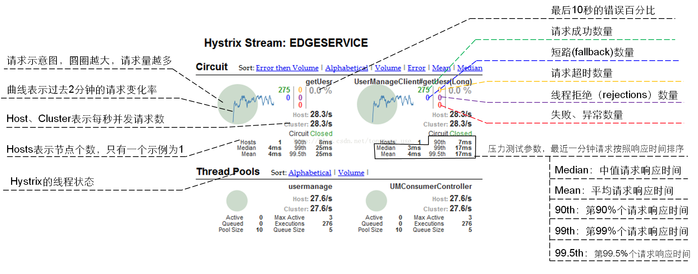

# Hystrix Dashboard

> 本文档描述框架对Hystrix Dashboard的使用。

* Hystrix监控的服务消费者的@FeignClient或者Ribbon+RestTemplate调用服务提供者的失败成功状况，所以Service类服务的指标数据不会太多，因为Service类服务不会太多调用其他服务。
* 要开启Hystrix Dashboard功能，需要在启动类上增加@EnableHystrixDashboard注解，并开启actuator的hystrix.stream端点(框架默认开启了)。
* Dashboard地址：http(s)://${eureka.instance.ip-address}:${server.port}/${server.servlet.context-path}/hystrix
* 指标地址：http(s)://${eureka.instance.ip-address}:${server.port}/${server.servlet.context-path}/milepost-actuator/hystrix.stream

Dashboard页面信息含义如下：

> 注意：Hystrix Dashboard与应用绑定，每个应有都有独立的监控页面，这样不好管理，
所以推荐使用Hystrix Turbine来实现聚合监控，即使用一个独立的服务来监控其他所有服务，
所以框架没有开启每个服务的Hystrix Dashboard功能，只是暴露了每个服务的hystrix.stream。
关于Hystrix Turbine的使用见[Hystrix Turbine](9hystrixTurbine.md)

