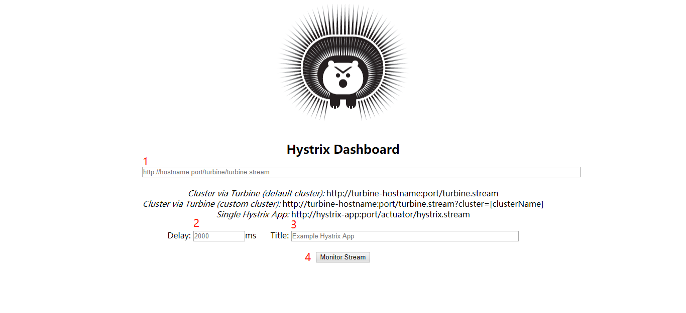
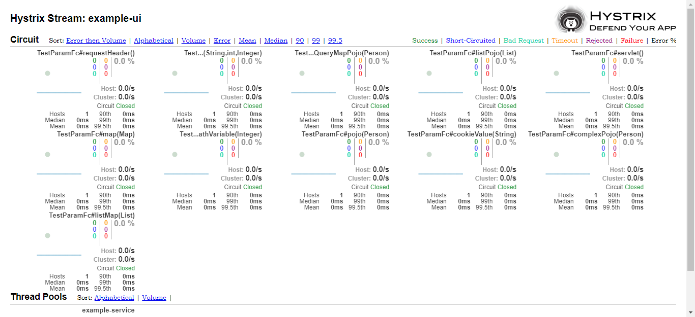
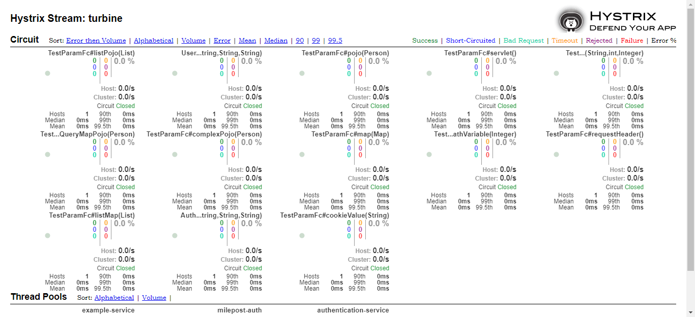

# Hystrix Turbine

> 本文档描述框架对Hystrix Turbine的使用。

* Hystrix Turbine 相关文档在 https://github.com/Netflix/Turbine/wiki/Configuration-(1.x)
* 首先需要部署Hystrix Turbine监控服务，具体见[HystrixTurbine监控服务部署](../../2userManual/1baseServerDeploy/4milepost-turbine.md)。
* 框架更改了Hystrix Turbine部分代码，实现了以[租户](../../3guideForDevelopment/2distributedDevelopment/2tenant.md)为单位聚合监控，
即每个租户都有自己的Hystrix Turbine监控服务，这个Hystrix Turbine监控自己租户下的服务实例。
* Turbine地址：http(s)://${eureka.instance.ip-address}:${server.port}/${server.servlet.context-path}/hystrix
* 单一服务实例指标地址(指向要监控的服务实例)：http(s)://${eureka.instance.ip-address}:${server.port}/${server.servlet.context-path}/milepost-actuator/hystrix.stream
* 聚合指标地址(指向Hystrix Turbine)：http(s)://${eureka.instance.ip-address}:${server.port}/${server.servlet.context-path}/turbine.stream
* 监控页面与[Hystrix Dashboard](8hystrixDashboard.md)中是一样的，只是把多个服务实例的指标聚合在一起了。

* 相关示例：
  * Turbine地址：http://192.168.223.129:8769/milepost-turbine/hystrix
  
  * 单一服务实例指标地址(指向要监控的服务实例)：http://192.168.223.1:9980/example-ui/milepost-actuator/hystrix.stream 
  在上图中1处填入要监控的服务实例的指标地址，2是延时，单位ms，3是页面的标题，点击4即可看到下面的指标页面： 
  
  
  这一个页面中显示出example-ui这个服务在当前租户下的实例的指标。
  * 聚合指标地址(指向Hystrix Turbine)：http://192.168.223.129:8769/milepost-turbine/turbine.stream 
  将1处的指标地址改成聚合指标地址，点击4即可看到下面的指标页面： 
  
  
  这一个页面中显示出当前租户下所有服务实例的指标。  
