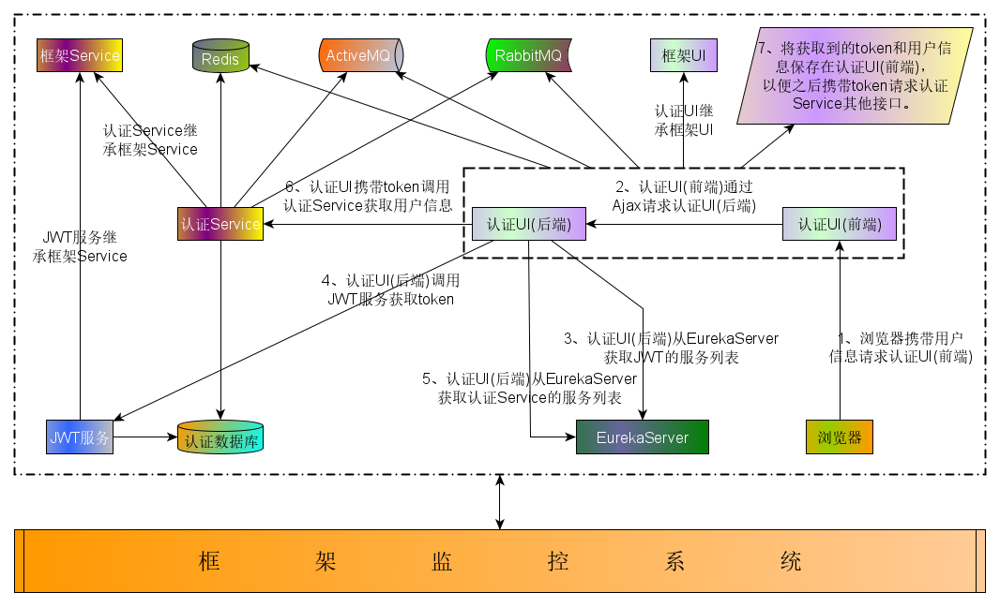

# milepost-framework

> milepost-framework 是一套分布式微服务框架，基于SpringCloud的Greenwich.RELEASE版本构建，对应的SpringBoot版本是2.1.0.RELEASE。 
框架在SpringCloud基础上增加了分布式微服务架构下开发常用的组件和功能； 
并对一些复杂的配置进行封装，使开发者需要做的配置减少，使开发变的简单快速。 

**下面通过认证服务登录的流程图来说明框架整体的结构**

> 本文档包含milepost-framework框架的所有资料，阅读本文档需要了解微服务、 
分布式、集群、SpringCloud、SpringBoot相关知识。
阅读时需要先读完 **概述** 章节，然后可以按需独立阅读。

# 1、概述
1.1、[术语表](1summary/1term.md) 
1.2、[框架简介](1summary/2introduction.md) 
1.3、[FQA](1summary/3fqa.md) 

# 2、用户使用手册
# 2.1、基础服务部署
2.1.1、[EurekaServer部署](2userManual/1baseServerDeploy/1eurekaServer.md) 
2.1.2、[JWT服务部署](2userManual/1baseServerDeploy/2jwtServer.md) 
2.1.3、[认证服务部署](2userManual/1baseServerDeploy/3authentication.md) 
2.1.4、[分布式事务管理端部署](2userManual/1baseServerDeploy/4tx-lcn-manager.md) 
2.1.5、[Hystrix Turbine监控服务部署](2userManual/1baseServerDeploy/5milepost-turbine.md) 
2.1.6、[SpringBoot Admin监控服务部署](2userManual/1baseServerDeploy/6milepost-admin.md) 
2.1.7、[Zipkin服务部署](2userManual/1baseServerDeploy/7zipkin.md) 

# 2.2、中间件部署
2.2.1、[Redis](2userManual/2middlewareDeploy/1redis.md) 
2.2.2、[ActiveMQ](2userManual/2middlewareDeploy/2activeMQ.md) 
2.2.3、[RabbitMQ](2userManual/2middlewareDeploy/3rabbitMQ.md) 
2.2.4、[Elasticsearch](2userManual/2middlewareDeploy/4elasticsearch.md) 
2.2.5、[Kibana](2userManual/2middlewareDeploy/5kibana.md) 

# 3、开发指南
## 3.1、常规开发
3.1.1、[框架日志](3guideForDevelopment/1commonDevelopment/1logger.md) 
3.1.2、[Flyway](3guideForDevelopment/1commonDevelopment/2flyway.md) 
3.1.3、[发送邮件](3guideForDevelopment/1commonDevelopment/3senderMail.md) 
3.1.4、[Mybatis缓存](3guideForDevelopment/1commonDevelopment/4mybatisCache.md) 
3.1.5、[Mybatis Generator](3guideForDevelopment/1commonDevelopment/5mybatisGenerator.md) 
3.1.6、[Swagger](3guideForDevelopment/1commonDevelopment/6swagger.md) 
3.1.7、[获取有效的token](3guideForDevelopment/1commonDevelopment/7getToken.md) 
3.1.8、[请求被oauth保护的接口并在接口中获取用户信息](3guideForDevelopment/1commonDevelopment/8auth.md) 
3.1.9、[RestTemplate](3guideForDevelopment/1commonDevelopment/9restTemplate.md) 
3.1.10、[单元测试](3guideForDevelopment/1commonDevelopment/10junitTest.md) 
3.1.11、[配置文件加密](3guideForDevelopment/1commonDevelopment/11configEncryption.md) 
3.1.12、[多数据源](3guideForDevelopment/1commonDevelopment/12dynamicDs.md) 
3.1.13、[ActiveMQ](3guideForDevelopment/1commonDevelopment/13activeMQ.md) 
3.1.14、[RabbitMQ](3guideForDevelopment/1commonDevelopment/14rabbitMQ.md) 
3.1.15、[基于Redis的集中式缓存](3guideForDevelopment/1commonDevelopment/15redis.md) 
3.1.16、[优雅停止服务](3guideForDevelopment/1commonDevelopment/16gracefullyStop.md) 
3.1.17、[异步线程池](3guideForDevelopment/1commonDevelopment/17asyncThreadPool.md) 
3.1.18、[自定义异常页面](3guideForDevelopment/1commonDevelopment/18customExPage.md) 
3.1.19、[文件上传](3guideForDevelopment/1commonDevelopment/19fileupload.md) 
3.1.20、[定制Tomcat](3guideForDevelopment/1commonDevelopment/20customizerTomcat.md) 

## 3.2、分布式开发
3.2.1、[分布式事务集成手册](3guideForDevelopment/2distributedDevelopment/1tx-lcn-client.md) 
3.2.2、[租户、标签、权重](3guideForDevelopment/2distributedDevelopment/2tenant.md) 
3.2.3、[分布式锁](3guideForDevelopment/2distributedDevelopment/3lock.md) 
3.2.4、[OpenFeign参数传递](3guideForDevelopment/2distributedDevelopment/4openFeignParam.md) 
3.2.5、[OpenFeign参数配置](3guideForDevelopment/2distributedDevelopment/5openFeignConf.md) 
3.2.6、[Ribbon参数配置](3guideForDevelopment/2distributedDevelopment/6ribbonConf.md) 
3.2.7、[Hystrix 熔断和降级](3guideForDevelopment/2distributedDevelopment/7hystrix.md) 
3.2.8、[Hystrix Dashboard](3guideForDevelopment/2distributedDevelopment/8hystrixDashboard.md) 
3.2.9、[Hystrix Turbine](3guideForDevelopment/2distributedDevelopment/9hystrixTurbine.md) 
3.2.10、[SpringBoot Admin](3guideForDevelopment/2distributedDevelopment/10springbootAdmin.md) 
3.2.11、[Spring Cloud Bus](3guideForDevelopment/2distributedDevelopment/11springCloudBus.md) 
3.2.12、[SpringCloud Sleuth](3guideForDevelopment/2distributedDevelopment/12springCloudSleuth.md) 

## 3.3、如何使用本框架开发一个项目
3.3.1、[搭建开发环境](3guideForDevelopment/3example/1buildDevEnv.md) 
3.3.2、[构建一个项目并打包发布到Linux上](3guideForDevelopment/3example/2projectExample.md) 

## 4、规划中内容
* 更改EurekaServer页面服务实例的多租户相关配置实时生效，可能会通过配置中心+消息总线方案来解决，也可能利用actuator的env和refresh端点动态修改刷新配置来解决。
* 安全相关，如RESTful API限速、SQL注入漏洞、CSRF跨站请求伪造等等。
* Docker、k8s支持。
* Flyway的企业版才能支持Oracle11G，可能会改成使用SpringBoot自己的数据库初始化工具，具体见https://docs.spring.io/spring-boot/docs/2.1.10.RELEASE/reference/html/howto-database-initialization.html#howto-initialize-a-database-using-spring-jdbc。
* 框架基准测试。

<!--
# 5、框架参考
* 《深入理解Spring Cloud与微服务构建 第2版》
* 方志朋相关书籍、博客
* [Spring Boot 2.1.0 Reference Guid](https://docs.spring.io/spring-boot/docs/2.1.0.RELEASE/reference/html/) 
* [Spring Cloud Greenwich.SR5 Reference Guid](https://cloud.spring.io/spring-cloud-static/Greenwich.SR5/) 
-->

<!--
需要补充的文档：
1、##3.3、使用本框架构建的开发示例

-->

<!--
需要增加的功能

-->
<!--
ButList
1、[WARN ] [o.s.s.oauth2.provider.endpoint.TokenEndpoint      : 169 ] - Handling error: ClientAbortException, java.io.IOException: 断开的管道

-->
