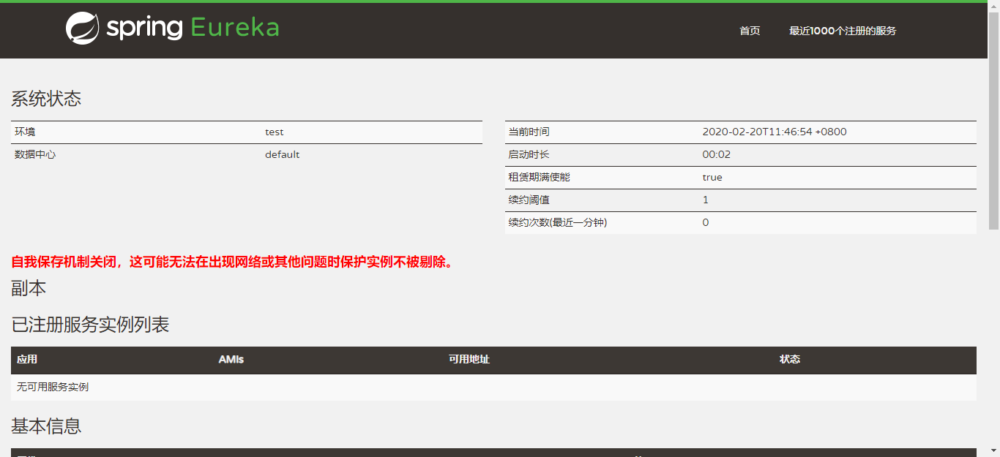
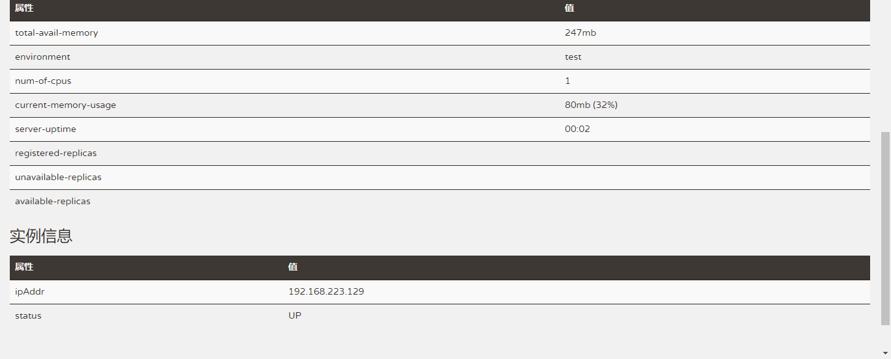

# EurekaServer部署

## 1、软件环境
* JDK1.8+

## 2、所需资料

| 文件名                     | 说明       |
| -------------------------- | ---------- |
| milepost-eureka-1.0.0.100.jar | 程序jar包 |
| run.sh                     | 启停脚本   |

## 3、服务启停

* 启动

```bash
run.sh start
```

* 停止

```bash
run.sh stop
```

* 重启

```bash
run.sh restart
```

##  4、启动脚本中的参数
* Java参数

| 参数名 | 必填 | 默认值 | 说明 |
| -------| ----| ------| ---- |
| ssl   | 否   |false  |是否用https，true启用，false不启用|


* 命令参数

| 参数名                      | 必填 | 默认值 | 说明                                                         |
| ---------------------------| ---- | ------ | ------------------------------------------------------------ |
|spring.profiles.active|是|  |配置文件环境，dev：开发环境；test：测试环境；prod：生产环境
|server.port|否|8761|服务端口
|eureka.instance.ip-address|是|  |服务绑定ip，配置为服务器ip即可
|eureka.server.enable-self-preservation|    否| true|    开启自我保护机制，true：开启；false：关闭

## 5、验证


* 查看日志

服务启动成功后，会在jar包所在的目录下生成logs文件夹，里面存放着日志文件，使用下面的命令查看日志。
```bash
tail -f logs/milepost-eureka.log -n 300
```
日志中有
```html
...[INFO ] [com.milepost.core.MilepostApplication             : 844 ] - 服务启动完毕。
```
字样表示服务启动成功。

* 访问首页

```
http://${eureka.instance.ip-address}:${server.port}/
```
看到如下页面表示部署成功。




## 6、Docker支持
