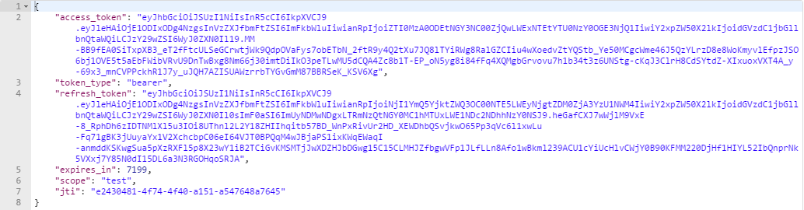

# JWT部署

## 1、软件环境
* JDK1.8+
* Oracle或MySQL
* 已经启动了EurekaServer
* 已经安装了Redis

## 2、所需资料

| 文件名                     | 说明       |
| -------------------------- | ---------- |
| milepost-eureka-1.0.0.100.jar | 程序jar包 |
| run.sh                     | 启停脚本   |

## 3、服务启停

* 启动

```bash
run.sh start
```

* 停止

```bash
run.sh stop
```

* 重启

```bash
run.sh restart
```

##  4、启动脚本中的参数
* Java参数

| 参数名 | 必填 | 默认值 | 说明 |
| -------| ----| ------| ---- |
| ssl   | 否   |false  |是否用https，true启用，false不启用|


* 命令参数

| 参数名                      | 必填 | 默认值 | 说明                                                         |
| ---------------------------| ---- | ------ | ------------------------------------------------------------ |
|spring.profiles.active|是|  |配置文件环境，<br>dev：开发环境；test：测试环境；prod：生产环境
|server.port|是| |服务端口，建议设置为9999
|spring.datasource.druid.db-type|是| |数据库类型，mysql、oracle
|spring.datasource.druid.driver-class-name|是|   |数据库驱动类，<br>com.mysql.cj.jdbc.Driver、oracle.jdbc.driver.OracleDriver
|spring.datasource.druid.url|是| |连接数据库url
|spring.datasource.druid.username|是 |   |用户名
|spring.datasource.druid.password|是|    |密码
|multiple-tenant.tenant|否|default|实例租户，不区分大小写，不支持逗号分割。<br>如果当前服务未设置租户，则他可以选择设置或未设置租户的所有服务，<br>如果当前服务设置了租户，则只选择与他设置了相同租户的服务。
|multiple-tenant.weight|否|1|实例权重，0和正整数，<br>实例被选中的概率是（实例权重值/所有实例权重值之和），权重为0的服务永远不会被选中。
|multiple-tenant.label-and|否|   |与标签，格式：aa,bb,cc，多个标签支持逗号分割。<br>两个服务实例的标签完全相等才选中服务实例，<br>即标签集合中元素个数相等，元素相等，不区分顺序。<br>如果当前服务同时设置了或标签和与标签，则以或标签为准，<br>忽略与标签，因为或标签过滤结果为空时，与标签一定为空。<br>如果当前服务未设置或标签，也未设置与标签，则他可以选择设置或未设置标签的所有服务。
|multiple-tenant.label-or|否|    |或标签，格式：aa,bb,cc，多个标签支持逗号分割。<br>两个服务实例的标签交集不为空，就选中服务实例。
|eureka.instance.ip-address|是|  |服务绑定ip，配置为服务器ip即可
|eureka.server.enable-self-preservation|    否| true|    开启自我保护机制，<br>true：开启；false：关闭

## 5、验证


* 查看日志

服务启动成功后，会在jar包所在的目录下生成logs文件夹，里面存放着日志文件，使用下面的命令查看日志。
```bash
tail -f logs/milepost-eureka.log -n 300
```
日志中有
```html
...[INFO ] [com.milepost.core.MilepostApplication             : 844 ] - 服务启动完毕。
```
字样表示服务启动成功。

* 获取token

初始用户：admin/123456

post请求如下接口
```
http://${eureka.instance.ip-address}:${server.port}/milepost-auth/oauth/token?username=admin&password=123456&grant_type=password
```
返回如下json数据表示部署成功。



## 6、Docker支持
